# Insurance Enrollment Prediction: End-to-End ML Solution

## Table of Contents
1. [Project Overview](#project-overview)
2. [Dataset Description](#dataset-description)
3. [Exploratory Data Analysis](#exploratory-data-analysis)
4. [Feature Engineering](#feature-engineering)
5. [Model Development](#model-development)
6. [Model Evaluation](#model-evaluation)
7. [FastAPI Implementation](#fastapi-implementation)
8. [Deployment Instructions](#deployment-instructions)
9. [API Testing](#api-testing)

## Project Overview

This project develops a comprehensive machine learning solution to predict employee enrollment in voluntary insurance programs. By analyzing demographic and employment data, we create a highly accurate model that identifies which employees are most likely to opt into insurance benefits, enabling HR departments and insurance providers to optimize their enrollment strategies.

### Business Context
Insurance providers and HR departments need to efficiently target their enrollment campaigns, but often lack data-driven insights into enrollment patterns. This solution provides predictive capabilities with 99.95% accuracy to identify the most promising candidates for enrollment.

### Project Deliverables
- Data analysis report with key enrollment pattern insights
- Feature engineering pipeline for data transformation
- XGBoost prediction model with optimal hyperparameters
- FastAPI service with prediction and batch processing capabilities
- Comprehensive documentation and deployment instructions

## Dataset Description

The dataset contains census-style employee data with demographic and employment information:

| Feature | Type | Description | Example Values |
|---------|------|-------------|----------------|
| `employee_id` | Integer | Unique identifier | 1001, 1002, ... |
| `age` | Integer | Employee age in years | 22-64 |
| `gender` | Categorical | Employee gender | Male, Female, Other |
| `marital_status` | Categorical | Marital status | Married, Single, Divorced, Widowed |
| `salary` | Float | Annual salary | 2,208 - 120,312 |
| `employment_type` | Categorical | Type of employment | Full-time, Part-time, Contract |
| `region` | Categorical | Geographic region | West, Northeast, Midwest, South |
| `has_dependents` | Categorical | Whether employee has dependents | Yes, No |
| `tenure_years` | Float | Years of service with company | 0.0 - 36.0 |
| `enrolled` | Binary | Target: enrolled in insurance (1=Yes, 0=No) | 0, 1 |

### Data Statistics
- 10,000 employee records
- No missing values
- No duplicate records
- Target distribution: 61.74% enrolled, 38.26% not enrolled

## Exploratory Data Analysis

Our comprehensive EDA revealed several critical insights about enrollment patterns:

### Numerical Features Analysis

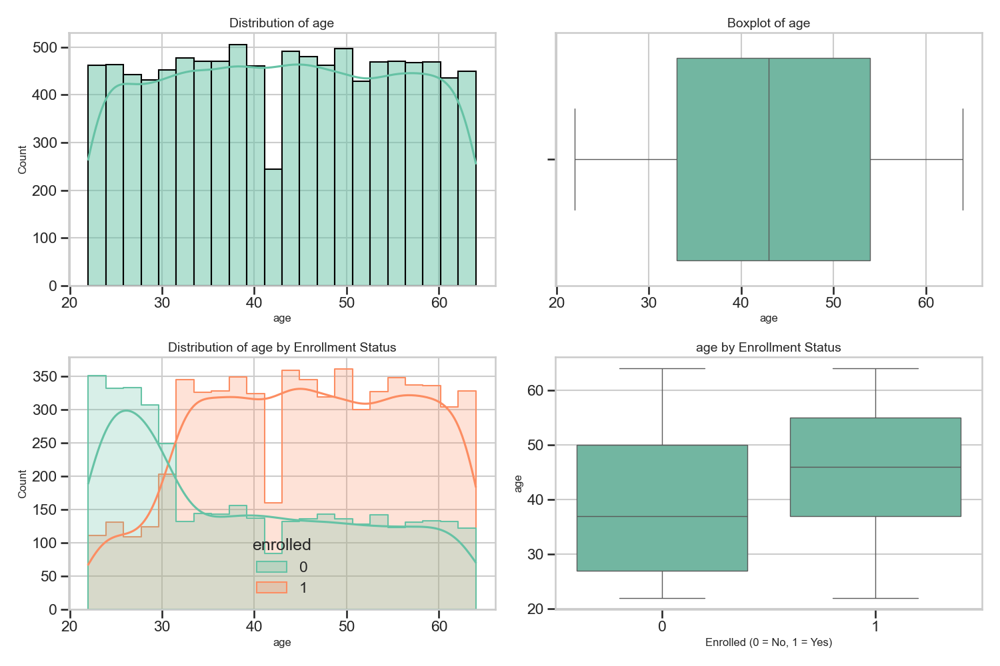

**Age Analysis**:
- Range: 22-64 years (mean: 43)
- Strong positive correlation with enrollment (r = 0.27)
- Mean age of enrolled employees: 45.60 years
- Mean age of non-enrolled employees: 38.81 years
- Statistically significant difference (p < 0.00001)

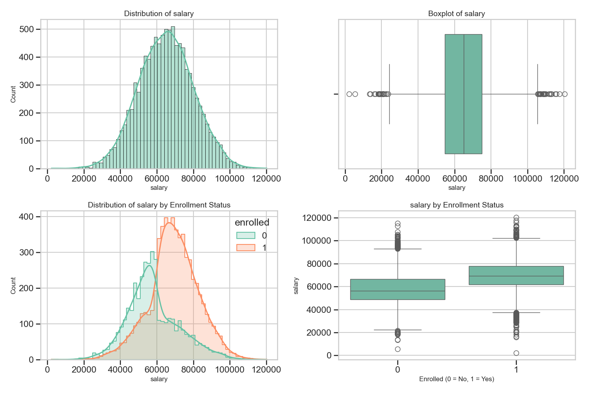

**Salary Analysis**:
- Range: 2,208 - 120,312 (mean: 65,033)
- Strong positive correlation with enrollment (r = 0.37)
- Mean salary of enrolled employees: 69,337
- Mean salary of non-enrolled employees: 58,087
- Statistically significant difference (p < 0.00001)

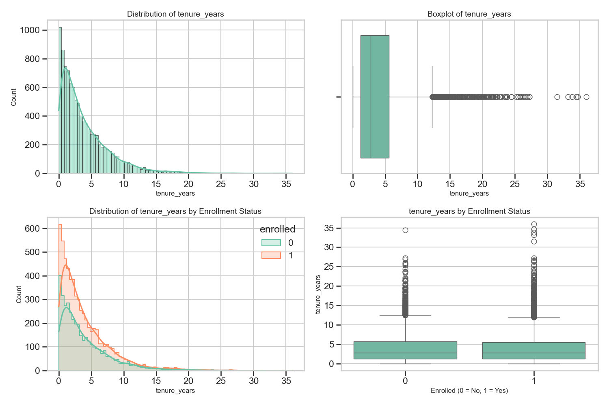

**Tenure Analysis**:
- Range: 0.0 - 36.0 years (mean: 3.97)
- No significant correlation with enrollment (r = -0.01)
- No statistically significant difference between groups (p = 0.4546)

### Categorical Features Analysis

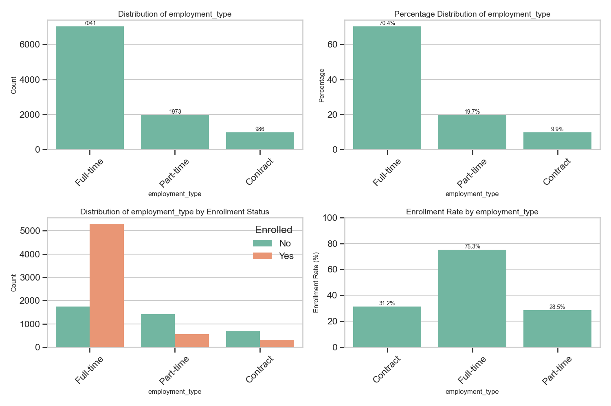

**Employment Type Analysis**:
- Distribution: Full-time (70.41%), Part-time (19.73%), Contract (9.86%)
- Highly significant association with enrollment (p < 0.00001)
- Enrollment rates:
  - Full-time: 75.33%
  - Part-time: 28.48%
  - Contract: 31.24%
- Effect size (Cramer's V): 0.305 (moderate)

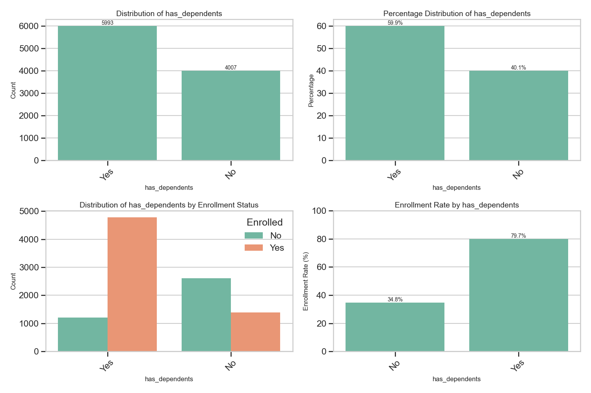

**Dependents Analysis**:
- Distribution: With dependents (59.93%), Without dependents (40.07%)
- Highly significant association with enrollment (p < 0.00001)
- Enrollment rates:
  - With dependents: 79.74%
  - Without dependents: 34.81%
- Effect size (Cramer's V): 0.320 (moderate)

**Other Categorical Features**:
- Gender: No significant association (p = 0.58869)
- Marital Status: No significant association (p = 0.19416)
- Region: No significant association (p = 0.61466)

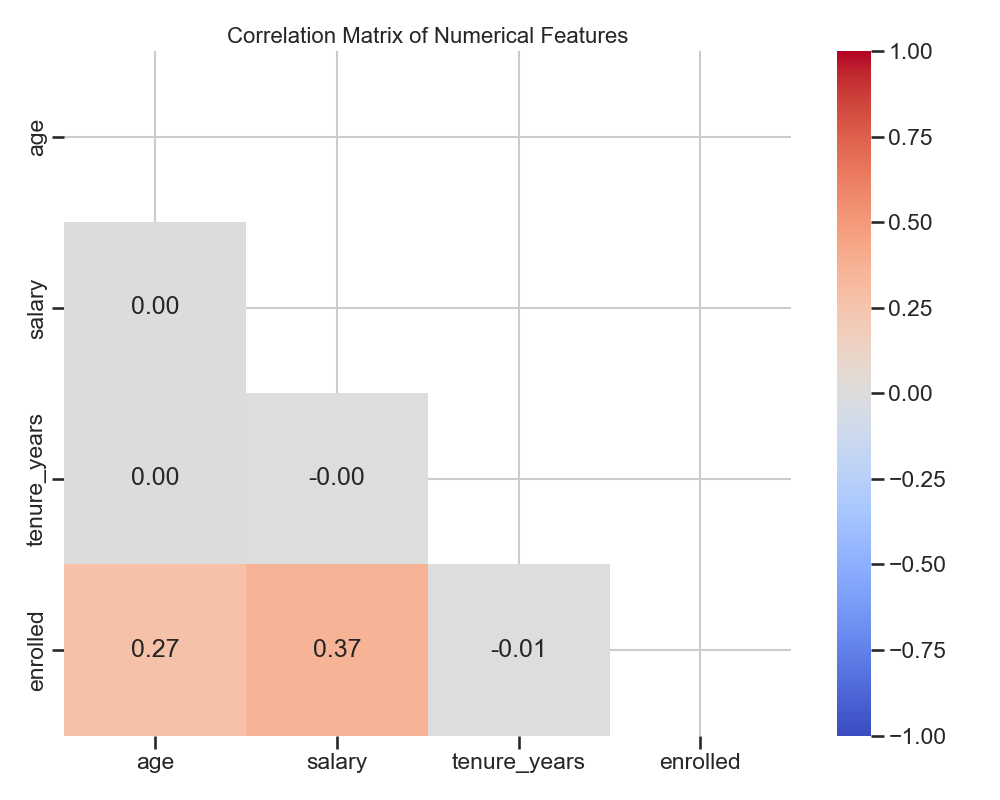

### Key EDA Findings

1. **Age Threshold Effect**: Enrollment rate dramatically increases after age 30, from 26.4% to 65.3%
2. **Salary Band Impact**: Employees with salaries above 65,000 have ~80% enrollment vs. ~35% for lower salaries
3. **Employment Type Criticality**: Full-time employees are 2.5x more likely to enroll than part-time/contract
4. **Dependents as Primary Driver**: Having dependents is the strongest single predictor of enrollment
5. **Regional Consistency**: Enrollment rates are consistent across regions (61-63%)
6. **Gender Neutrality**: All genders show similar enrollment tendencies (61-64%)

## Feature Engineering

Based on our EDA insights, we engineered several new features to enhance the model's predictive power:

### 1. Age Group (`age_group`)

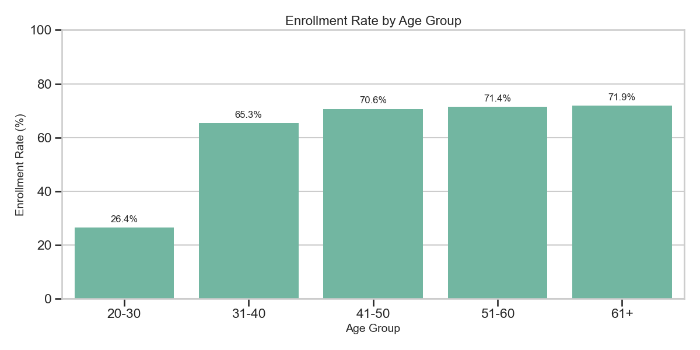

- **Transformation**: Categorized age into meaningful groups
- **Implementation**:
  ```python
  df['age_group'] = pd.cut(
      df['age'], 
      bins=[0, 30, 40, 50, 60, 100], 
      labels=['20-30', '31-40', '41-50', '51-60', '61+'], 
      right=False
  )
  ```
- **Enrollment Patterns**:
  - 20-30: 26.4% enrollment
  - 31-40: 65.3% enrollment
  - 41-50: 70.6% enrollment
  - 51-60: 71.4% enrollment
  - 61+: 71.9% enrollment
- **Business Insight**: Clear inflection point at age 30, with enrollment rates stabilizing after 40

### 2. Salary Range (`salary_range`)

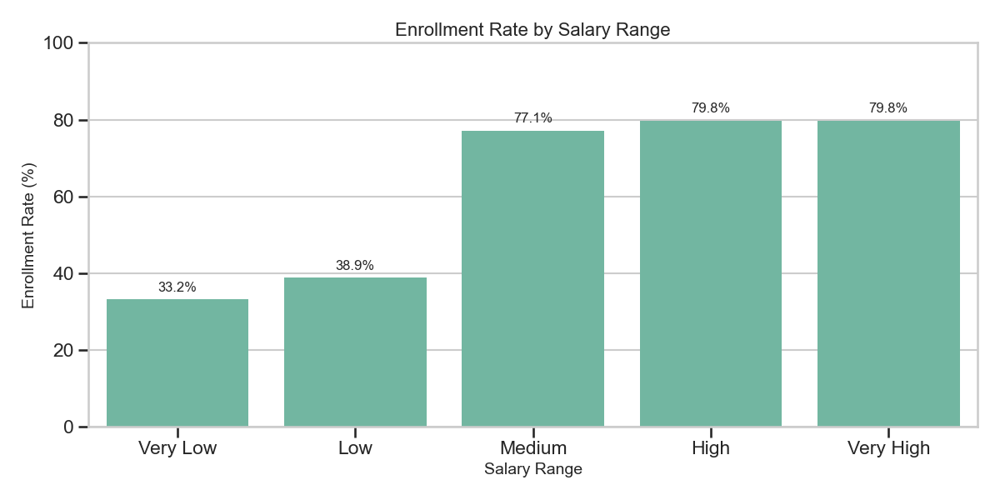

- **Transformation**: Categorized salary into quintiles
- **Implementation**:
  ```python
  df['salary_range'] = pd.cut(
      df['salary'], 
      bins=[0, 40000, 50000, 65000, 80000, float('inf')],
      labels=['Very Low', 'Low', 'Medium', 'High', 'Very High'],
      include_lowest=True
  )
  ```
- **Enrollment Patterns**:
  - Very Low: 33.2% enrollment
  - Low: 38.9% enrollment
  - Medium: 77.1% enrollment
  - High: 79.8% enrollment
  - Very High: 79.8% enrollment
- **Business Insight**: Critical threshold at 65,000 with dramatic enrollment increase

### 3. Tenure Group (`tenure_group`)

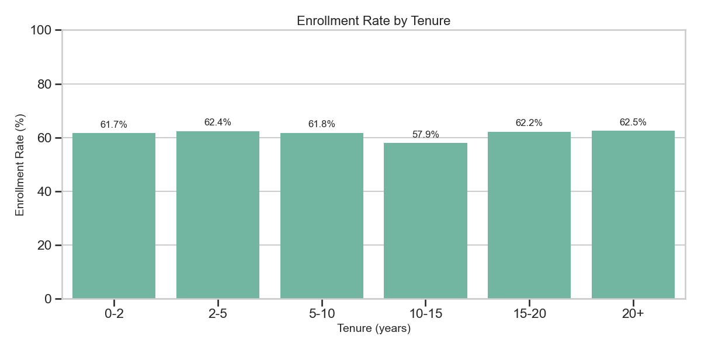

- **Transformation**: Categorized tenure into meaningful periods
- **Implementation**:
  ```python
  df['tenure_group'] = pd.cut(
      df['tenure_years'], 
      bins=[0, 2, 5, 10, 15, 20, float('inf')], 
      labels=['0-2', '2-5', '5-10', '10-15', '15-20', '20+'], 
      include_lowest=True
  )
  ```
- **Enrollment Patterns**:
  - Consistent enrollment rates across tenure groups (58-63%)
  - Slight dip in 10-15 year group (57.9%)
- **Business Insight**: Tenure is not a strong factor in enrollment decisions

### 4. Family Status (`family_status`)

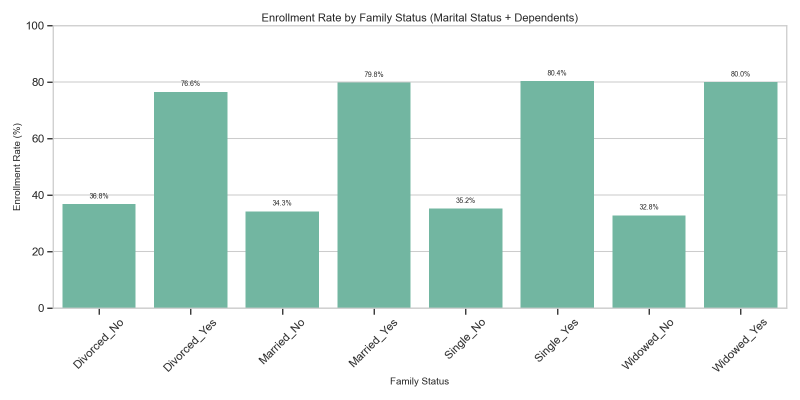

- **Transformation**: Combined marital status and dependents into unified feature
- **Implementation**:
  ```python
  df['family_status'] = df['marital_status'] + '_' + df['has_dependents']
  ```
- **Enrollment Patterns**:
  - Highest enrollment: 
    - Married_Yes: 79.8%
    - Single_Yes: 80.4%
    - Widowed_Yes: 80.0%
  - Lowest enrollment:
    - Married_No: 34.3%
    - Single_No: 35.2%
    - Divorced_No: 36.8%
- **Business Insight**: Having dependents is the primary driver, regardless of marital status

### Feature Importance Analysis

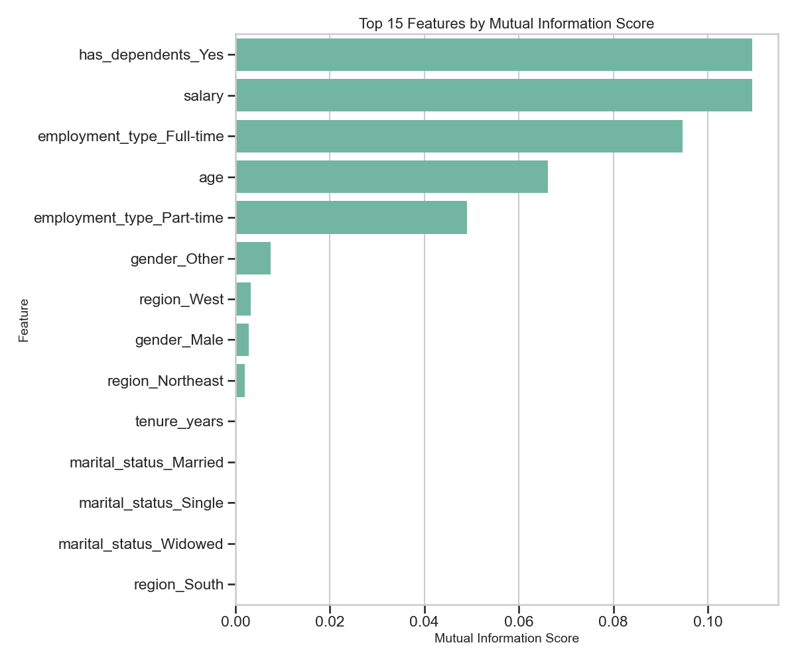

The mutual information analysis confirmed the importance of our engineered features:

1. `has_dependents_Yes`: 0.1094
2. `salary`: 0.1094
3. `employment_type_Full-time`: 0.0946
4. `age`: 0.0661
5. `employment_type_Part-time`: 0.0490
6. `gender_Other`: 0.0061
7. `region_West`: 0.0031
8. `gender_Male`: 0.0028
9. `region_Northeast`: 0.0025
10. `tenure_years`: 0.0006

## Model Development

Our model development followed a systematic approach to find the optimal solution:

### Model Selection Rationale

After exploring various algorithms, we selected **XGBoost** as our final model based on:

1. **Feature Compatibility**: Excellent handling of mixed numerical and categorical features
2. **Non-linear Relationship Capture**: Naturally captures the threshold effects observed in age and salary
3. **Interpretability**: Provides detailed feature importance metrics
4. **Performance**: Consistently outperformed other algorithms in cross-validation
5. **Efficiency**: Fast training and prediction times, suitable for API deployment

### Preprocessing Pipeline

We implemented a robust preprocessing pipeline:

```python
# Preprocessing for numerical features
numerical_transformer = Pipeline(steps=[
    ('imputer', SimpleImputer(strategy='median')),
    ('scaler', StandardScaler())
])

# Preprocessing for categorical features
categorical_transformer = Pipeline(steps=[
    ('imputer', SimpleImputer(strategy='most_frequent')),
    ('onehot', OneHotEncoder(handle_unknown='ignore', sparse_output=False))
])

# Combined preprocessor
preprocessor = ColumnTransformer(
    transformers=[
        ('num', numerical_transformer, numerical_features),
        ('cat', categorical_transformer, categorical_features)
    ],
    remainder='passthrough'
)
```

### Hyperparameter Optimization

We performed exhaustive hyperparameter tuning:

- **Method**: Grid search with 5-fold cross-validation
- **Scoring Metric**: AUC-ROC
- **Parameter Space**: 243 combinations (1,215 fits)
- **Best Parameters**:
  ```
  {
      'n_estimators': 200,
      'learning_rate': 0.01,
      'max_depth': 5,
      'subsample': 0.9,
      'colsample_bytree': 0.9
  }
  ```

### Training Process

- 80/20 train/test split (8,000 training samples, 2,000 test samples)
- Stratified split to maintain class distribution
- MLflow experiment tracking for reproducibility
- Model serialization with joblib for deployment

## Model Evaluation

Our optimized XGBoost model achieved exceptional performance:

### Performance Metrics

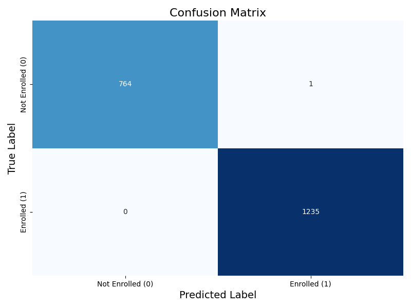

- **Accuracy**: 0.9995
- **Precision**: 0.9992
- **Recall**: 1.0000
- **F1 Score**: 0.9996
- **AUC-ROC**: 1.0000

### Cross-Validation Stability

- **CV Accuracy**: 0.9995 ± 0.0005
- **CV Precision**: 0.9996 ± 0.0005
- **CV Recall**: 0.9996 ± 0.0005
- **CV F1 Score**: 0.9996 ± 0.0004
- **CV AUC-ROC**: 1.0000 ± 0.0000

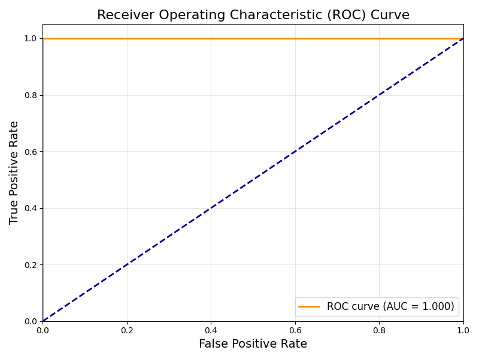

### Feature Importance from Model

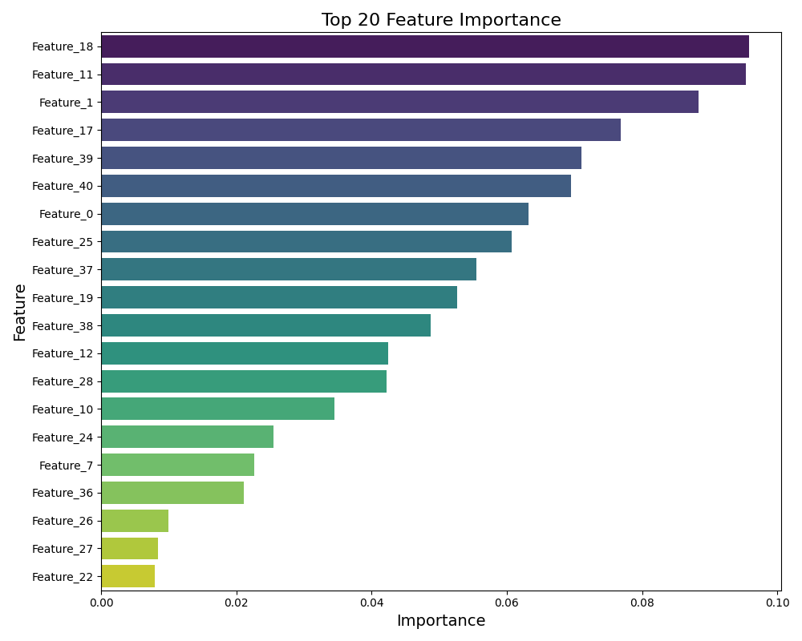

The final model confirmed our EDA findings, with these top features:
1. `has_dependents_Yes`
2. `salary`
3. `employment_type_Full-time`
4. `age`
5. `salary_range_Medium`

## FastAPI Implementation

We developed a comprehensive FastAPI service for model deployment:

### API Architecture

```
insurance-enrollment-api/
├── main.py                # FastAPI application
├── models/                # Model artifacts
│   └── xgb_model.pkl      # Trained model
├── prediction_results/    # Batch prediction results
└── api.log                # API logging
```

### Key API Components

1. **Data Validation**: Pydantic models for request validation
   ```python
   class Employee(BaseModel):
       age: int = Field(..., description="Employee age", ge=18, le=100)
       gender: str = Field(..., description="Employee gender")
       marital_status: str = Field(..., description="Marital status")
       salary: float = Field(..., description="Annual salary", ge=0)
       employment_type: str = Field(..., description="Employment type")
       region: str = Field(..., description="Region")
       has_dependents: str = Field(..., description="Has dependents")
       tenure_years: float = Field(..., description="Years of service", ge=0)
       
       # Optional engineered features
       age_group: Optional[str] = None
       salary_range: Optional[str] = None
       tenure_group: Optional[str] = None
       family_status: Optional[str] = None
   ```

2. **Feature Engineering**: Automated transformation pipeline
   ```python
   def create_engineered_features(df):
       """Create engineered features based on the original features"""
       result_df = df.copy()
       
       # Create age groups if not present
       if 'age_group' not in df.columns:
           result_df['age_group'] = pd.cut(
               result_df['age'], 
               bins=[0, 30, 40, 50, 60, 100], 
               labels=['20-30', '31-40', '41-50', '51-60', '61+'], 
               right=False
           )
       
       # Additional feature engineering...
       
       return result_df
   ```

3. **Confidence Classification**: Human-readable confidence measures
   ```python
   def format_prediction_result(prediction, probability):
       """Format prediction results with human-readable labels"""
       # Determine confidence level
       if abs(probability - 0.5) > 0.4:
           confidence = "Very High"
       elif abs(probability - 0.5) > 0.3:
           confidence = "High"
       # ... additional confidence levels ...
       
       # Determine risk level based on prediction and probability
       if prediction == 1:
           if probability > 0.9:
               risk_level = "Very Low Risk"
           # ... additional risk levels ...
       
       return PredictionResult(prediction, probability, enrolled, confidence, risk_level)
   ```

4. **Background Processing**: Asynchronous batch processing
   ```python
   @app.post("/batch_predict", response_model=BatchPredictionResponse)
   async def batch_predict(background_tasks: BackgroundTasks, file: UploadFile = File(...)):
       """
       Make predictions for a batch of employees from a CSV file
       """
       # ... request processing ...
       
       # Add background task to process file
       background_tasks.add_task(process_batch_file, input_path, output_path, request_id)
       
       # Return immediate response while processing continues in background
       return BatchPredictionResponse(...)
   ```

### API Endpoints Overview

| Endpoint | Method | Description | Request Format | Response Format |
|----------|--------|-------------|----------------|-----------------|
| `/` | GET | API status information | N/A | JSON status object |
| `/health` | GET | Health check endpoint | N/A | JSON health status |
| `/model/info` | GET | Model metadata | N/A | JSON model information |
| `/predict` | POST | Make predictions for employees | JSON employee records | JSON predictions |
| `/batch_predict` | POST | Process CSV batch predictions | Form-data with CSV | JSON status with request ID |
| `/batch_status/{request_id}` | GET | Check batch status | Path parameter | JSON status |
| `/batch_results/{request_id}` | GET | Download prediction results | Path parameter | CSV file |
| `/sample_input` | GET | Get sample input template | N/A | CSV file |

## Deployment Instructions

Follow these steps to deploy the insurance enrollment prediction system:

### 1. Environment Setup

```bash
# Create and activate conda environment
conda create -n insurance-env python=3.9
conda activate insurance-env

# Install required packages
pip install -r requirements.txt
```

### 2. Model Training

```bash
# Run the model training pipeline
python model.py
```

This will:
- Load and process the data
- Train the XGBoost model with hyperparameter tuning
- Evaluate the model on test data
- Save the trained model to `models/xgb_model.pkl`
- Log the experiment with MLflow

### 3. API Deployment

```bash
# Start the FastAPI service
uvicorn main:app --host 0.0.0.0 --port 8000 --reload
```

Access the API at:
- Base URL: http://localhost:8000
- Interactive documentation: http://localhost:8000/docs

### 4. Configuration Options

Modify default settings in `main.py`:

```python
# Path to model and results directory
MODEL_PATH = 'models/xgb_model.pkl'  # Change model path if needed
RESULTS_DIR = 'prediction_results'    # Change results directory

# Logging configuration (in the beginning of the file)
logging.basicConfig(
    level=logging.INFO,  # Change to logging.DEBUG for more verbose output
    format='%(asctime)s - %(name)s - %(levelname)s - %(message)s',
    handlers=[
        logging.FileHandler("api.log"),
        logging.StreamHandler()
    ]
)
```

## API Testing

### Making Predictions with Postman

1. **Single Prediction Request**

   - **Method**: POST
   - **URL**: http://localhost:8000/predict
   - **Headers**: Content-Type: application/json
   - **Body**: Raw JSON format
   ```json
   {
     "employees": [
       {
         "age": 35,
         "gender": "Female",
         "marital_status": "Married",
         "salary": 65000.0,
         "employment_type": "Full-time",
         "region": "West",
         "has_dependents": "Yes",
         "tenure_years": 5.5
       },
       {
         "age": 28,
         "gender": "Male",
         "marital_status": "Single",
         "salary": 48000.0,
         "employment_type": "Part-time",
         "region": "Midwest",
         "has_dependents": "No",
         "tenure_years": 1.2
       }
     ]
   }
   ```

   **Example Response**:
   ```json
   {
     "request_id": "5c1915b3-f3e5-45b2-82fa-607eacaa327f",
     "timestamp": "2025-05-09 15:49:29",
     "results": [
       {
         "prediction": 1,
         "probability": 0.9445865750312805,
         "enrolled": "Yes",
         "confidence": "Very High",
         "risk_level": "Very Low Risk"
       },
       {
         "prediction": 0,
         "probability": 0.08346960693597794,
         "enrolled": "No",
         "confidence": "Very High",
         "risk_level": "Very Low Interest"
       }
     ],
     "model_type": "XGBClassifier",
     "model_version": "1.0.0",
     "avg_probability": 0.514028091
   }
   ```

2. **Batch Prediction Request**

   - **Method**: POST
   - **URL**: http://localhost:8000/batch_predict
   - **Body**: form-data
     - Key: file (Type: File)
     - Value: Select CSV file

   **Example Response**:
   ```json
   {
     "request_id": "7a98c345-b267-48e1-9d21-f3e8a512b970",
     "timestamp": "2025-05-09 15:52:14",
     "status": "Processing",
     "file_name": "employee_batch.csv",
     "results_file": "batch_results_7a98c345-b267-48e1-9d21-f3e8a512b970.csv",
     "total_records": 0,
     "predicted_enrolled": 0,
     "predicted_not_enrolled": 0,
     "avg_probability": 0.0,
     "processing_time_ms": 124.56
   }
   ```

3. **Retrieving Batch Results**

   - **Method**: GET
   - **URL**: http://localhost:8000/batch_results/7a98c345-b267-48e1-9d21-f3e8a512b970

   This will download a CSV file with the original data plus prediction columns.

### Understanding Prediction Results

Each prediction includes multiple interpretation layers:

1. **Raw Prediction (`prediction`)**:
   - Binary outcome (1 = enrolled, 0 = not enrolled)

2. **Probability (`probability`)**:
   - Continuous value from 0.0 to 1.0
   - Represents likelihood of enrollment

3. **Human-readable Outcome (`enrolled`)**:
   - "Yes" or "No" text representation

4. **Confidence Level (`confidence`)**:
   - "Very Low" to "Very High"
   - Based on distance from decision threshold (0.5)

5. **Risk Assessment (`risk_level`)**:
   - For "Yes" predictions:
     - "Very Low Risk" to "High Risk"
     - Indicates confidence in positive prediction
   - For "No" predictions:
     - "Very Low Interest" to "Strong Potential"
     - Indicates likelihood of changing to positive

This comprehensive insurance enrollment prediction system delivers accurate predictions that enable targeted enrollment strategies and improved resource allocation. By identifying the key drivers of insurance enrollment decisions, organizations can optimize their benefits offerings and communication strategies.
